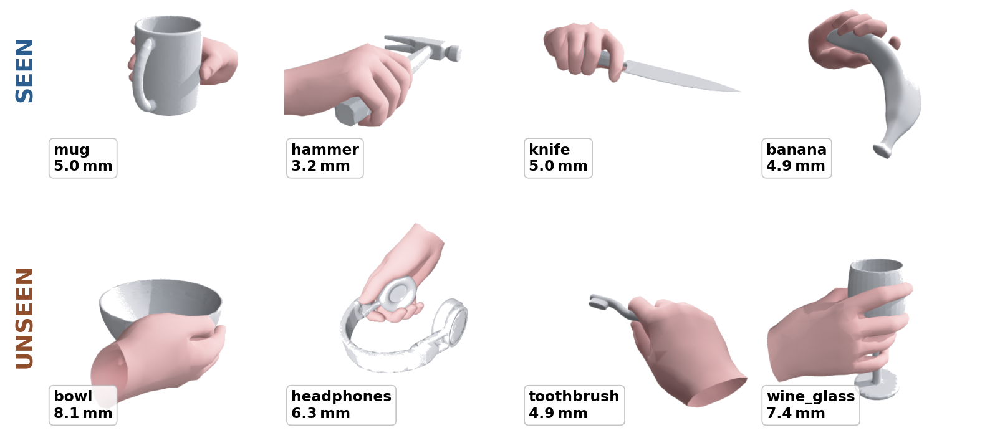

# GraspAuto

**Real-Time Single-Tap Grasp Authoring for VR/AR Experiences** — submitted to ACM SIGGRAPH 2026 Posters.

GraspAuto generates a realistic VR hand grasp from a single user tap on a 3D object. No motion-capture recording, no per-joint tuning. The key idea is a geometric conditioning token — a **grip-sphere** specifying where to grasp, how wide to open, and from which direction to approach — that is easy to elicit from a VR controller and dataset-agnostic enough for joint training across grasp corpora.



- **Project page**: [crazycatseven.github.io/GraspAuto](https://crazycatseven.github.io/GraspAuto/)
- **Paper**: [`paper/main.pdf`](paper/main.pdf) · [`paper/supplementary.pdf`](paper/supplementary.pdf)
- **Teaser video** (60 s, 1920×1080): [`paper/teaser_video.mp4`](paper/teaser_video.mp4)

## Results on ContactPose

| Config | TRUE SEEN | CP-UNSEEN | <10 mm | Latency |
| --- | --- | --- | --- | --- |
| Heatmap-palm baseline (bo-1) | 12.48 mm | 27.9 mm | 36 % | 60 ms |
| **Sphere, CP + OakInk filtered (shipped)** | **10.64 mm** | **13.70 mm** | **59 %** | **60 ms** |
| 8-member pool, GT oracle median | 5.14 mm | 6.79 mm | — | 30 s |
| Consensus medoid (deployable, no GT) | 9.74 mm | 12.71 mm | 67 % | 2 s |

Error metric is mode-cover: min over per-object GT grasps of mean 778-vertex L2 (mm). TRUE SEEN = 21 ContactPose val classes (N=179); CP-UNSEEN = the four remaining classes (bowl, headphones, toothbrush, wine_glass; 37 samples). See paper §Results and Supp. S5–S6 for split details.

## Repository layout

```
GraspAuto/
├── paper/            main.pdf, supplementary.pdf, teaser video, figures
├── docs/             GitHub Pages project page
├── src/
│   ├── graspauto/                 everything importable: MANO decoder/AE,
│   │                              velocity net, adapter, CFM sampler,
│   │                              grip-sphere token, Point-M2AE backbone,
│   │                              contact-graph dataset, loss helpers,
│   │                              ContactPose / OakInk / GraspXL loaders
│   └── preprocess_grip_sphere.py  offline MANO → 7-D grip-sphere
├── train/            train.py, train_distill_student_sphere.py, train_selector.py
├── eval/             eval.py, eval_ensemble_pool.py
└── scripts/          viz_paper_mode_cover.py   (Fig. 3)
                      viz_supp_gallery.py       (Supp. S8 gallery)
                      viz_supp_failures.py      (Supp. S9 failures)
                      make_teaser_video.py      (60 s teaser)
```

## Getting started

```bash
python -m venv .venv && source .venv/bin/activate   # Python 3.12
pip install -r requirements.txt
```

Training / eval / viz all need three external assets — they are **not** bundled:

1. **MANO v1.2** weights → `assets/mano_v1_2/models/MANO_RIGHT.pkl`
2. **ContactPose** meshes and metadata → `data/contactpose/`
3. **Pretrained checkpoints** → `outputs/graspauto_sphere_r047/best.pt` (and the seven other ensemble members)

Full walkthrough, including the preprocessing command and optional OakInk / GraspXL setup, is in **[`DATA.md`](DATA.md)**.

Scripts resolve the repository root from their own location, so you can run them from any working directory once the assets above are in place.

## Deployment

- **Mode A** (ship with precomputed object features): 28.9 MB fp32 / ~14.6 MB fp16 ONNX bundle + 95 KB per-object cache.
- **Mode B** (full on-device, includes Point-M2AE encoder): 90.3 MB fp32 / ~45 MB fp16.

The **Unity Sentis integration** for on-device VR deployment will be released here soon.

## Authors

- Qingxuan Yan — Cornell Tech, Cornell University — qy264@cornell.edu
- Xiang Chang — HKUST (Guangzhou) — xc529@cornell.edu

## License

MIT (see [`LICENSE`](LICENSE)). Paper text and figures are provided for review and citation.
